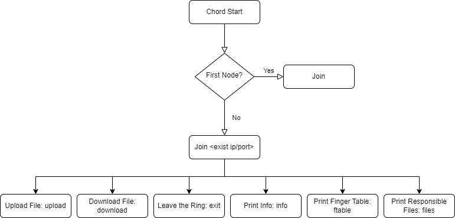

# chord-file-sharing

## Overview

Chord File Sharing is a decentralized and peer-to-peer file-sharing application that utilizes the Chord DHT (Distributed
Hash Table) protocol for efficient and scalable file distribution. This version of the project incorporates gRPC (gRPC
Remote Procedure Calls) for communication between nodes, enhancing the efficiency and maintainability of the system.
This Java application is a Chord Ring Management System that allows users to interact with a Chord distributed hash
table (DHT) ring. The system provides various commands for uploading files, joining or creating a ring, printing the
finger table, listing stored files and their corresponding keys, downloading files, and displaying node information. For
more information, please refer to the [Chord Paper](./chord.pdf). This project also uses GitHub Actions for continuous
integration.

## Table of Contents

- [Features](#features)
- [Getting Started](#getting-started)
- [Usage](#usage)
- [Commands](#commands)
- [Work Flow](#work-flow)
- [Future Work](#future-work)
- [Report](#report)
- [License](#license)

## Features

- Decentralized File Sharing: Chord File Sharing eliminates the need for a centralized server, allowing users to share
  files directly with each other.
- Scalability: The Chord DHT protocol enables scalable and efficient file sharing, making it suitable for a large number
  of users.
- Secure: The decentralized nature of the system enhances security, as there is no single point of failure or
  vulnerability.
- Persistent Content Hosting: Users can upload their content to the Chord ring, and it is stored on another node. This
  ensures that the content remains available even if the original owner leaves. Users can choose to host other content
  when they are online, contributing to the resilience and availability of shared files.
- Stabilization: The Chord ring is self-stabilizing, keeping nodes' successor pointers up to date, and telling the
  successor about itself, which is sufficient to guarantee the correctness of lookups. If a node leaves the ring, the
  current successor does not exist. It will not actively find a new successor, fixed fingers will tell the current node
  the correct successor.
- Fix Fingers: periodically refresh finger table entries.
- Soft Exit: When a node leaves the ring, it will notify its successor to take over the files that the node is hosting.
  The successor will update its predecessor pointer to the node's predecessor. It will also update all fingers that
  reference to self.

## Getting Started

To run the chord file-sharing application, set two environment variables: `HOST` and `PORT`.

- `PORT` is the port number that the node will listen on.
- `HOST` is the host address of the node. The host address can be a domain name or an IP address.

It will automatically create a folder named with the port number to store the files under `resources/<port>`. When app
starts, it starts grpc-java as a daemon thread by default.

Example of setting environment variables in IntelliJ IDEA:

`HOST=127.0.0.1;PORT=8000`

## Usage

The first node starts the ring should call `join` with no arguments first to create a new ring. The rest of the nodes
should call `join` with any known node host and port to join the ring.

### Commands

- `upload <file_path>`: Upload a file to the Chord ring.
- `join`: Start a new Chord ring or join an existing one if no ring is found.
- `join <ip> <port>`: Join an existing Chord ring. If no IP and port are provided, start a new ring.
- `ftable`: Print the finger table.
- `files`: Print the files stored in this node's map and their corresponding keys.
- `download <file_name>`: Download a file from the Chord ring.
- `info`: Print node information.
- `exit`: Quit the Chord ring. This is a graceful exit that notifies all nodes whose finger tables should refer to this
  node when leaving the ring.

## Work Flow

## Future Work

- [ ] Implement a GUI for the application.
- [x] Support SSL connection for grpc communication.
- [x] Support when a node leaves the ring, the successor of the node will take over the files that the node is hosting.
- [ ] Implement a successor list to keep track of *r* nearest successors. This enables the node to find its correct
  successor.
- [ ] Files should be stored in multiple nodes to avoid a single point of failure.
- [x] Soft exit.
- [ ] Hard exit.

## Report

[report](https://github.com/FengyiQuan/chord-file-sharing/blob/main/report.pdf)

## License

[license](https://github.com/FengyiQuan/chord-file-sharing/blob/main/LICENSE)
